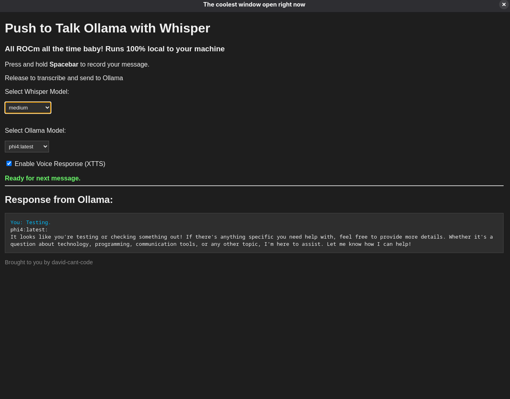

# ROCm Local AI Assistant
An electron app that utilizes Ollama and Whisper to implement a push-to-talk interface. This app implements ROCm in place of Cuda, and is made for systems with AMD GPUs

You must have Ollama already installed on your machine, this assumes you have a working Ollama isntance

Use at your own risk, this has not been thouroughly tested. You should never run scripts from the internet without reading them, so read my scripts first.

---

---

## Plans for the Future

- [ ] polish up the UI
- [ ] Make the setup smoother for non-technical users
- [ ] Test in more environments
- [ ] fix compatability with selinux systems
- [ ] other fun stuff

---


## Installation

1. Clone this repo and get setup:
    ```bash
    sudo apt install git -y
    ```
    ```bash
    git clone https://github.com/david-cant-code/ROCm-local-AI-assistant-with-Ollama-and-Whisper
    ```
    ```bash
    cd ROCm-local-AI-assistant-with-Ollama-and-Whisper
    ```
    ```bash
    chmod +x install.sh
    ```

2. Run the setup script:
    ```bash
    ./install.sh
    ```
5. Run the electron app, if crap happens, hit f12 while is running to get a console. The app will handle using the different venvs on its own
   ```bash
   npm start
   ```
